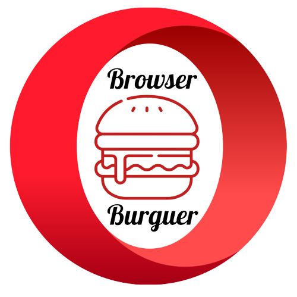
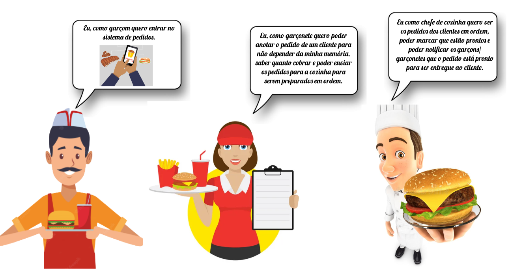
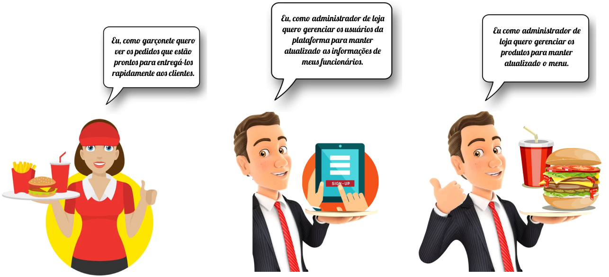
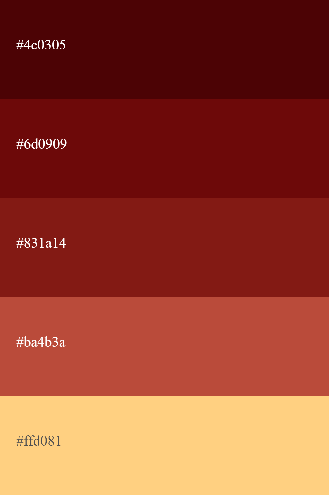
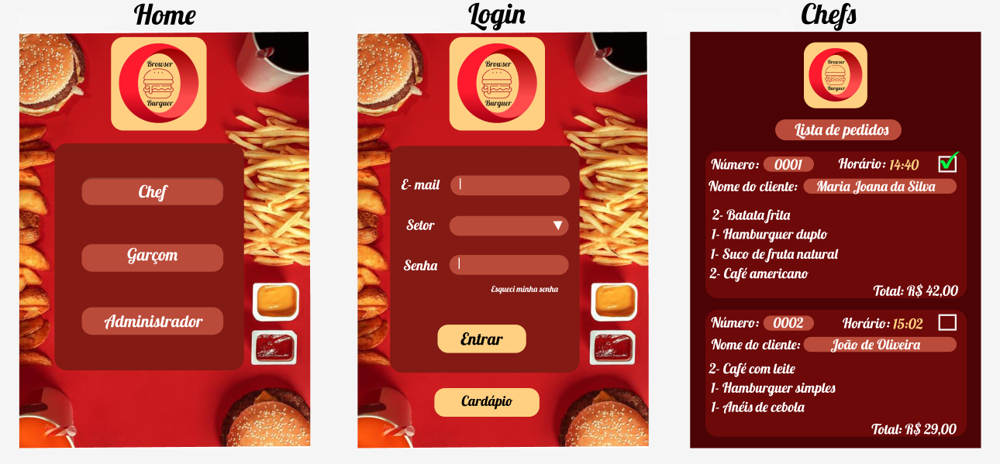
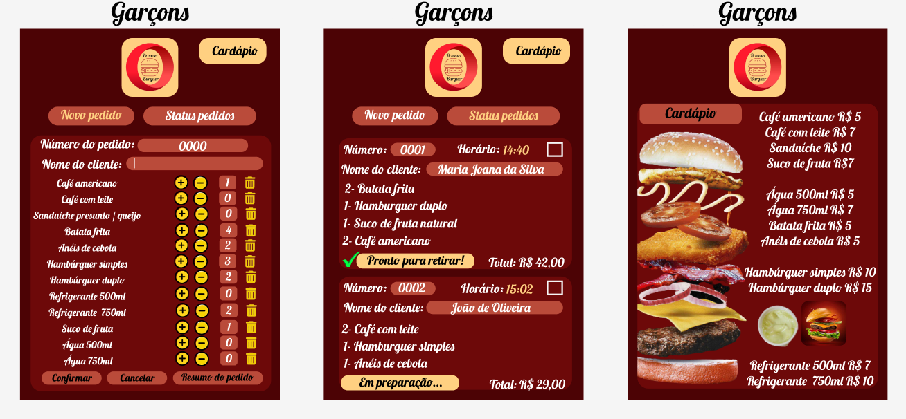

# 
 🍟 🍔 BROWSER BURGUER 🍔 🍟 

 

***

### RESUMO DO PROJETO

Neste projeto, está sendo desenvolvida uma interface em que se possa obter o controle de **pedidos de uma hamburgueria**. Ela irá possuir duas áreas, a interface e a API (servidor). Estamos construindo uma aplicação que se integrará com a API. O objetivo principal é garantir **funcionamento de diversos setores simultaneamente**, sendo eles: administração, atendimento e cozinha. Ou seja, estamos elaborando uma interface web utilizando **React**, e realizando o **consumo de API**, aplicando os princípios de integração entre elas.

*** 

### ENTENDENDO O PROBLEMA DO NOSSO CLIENTE... 🤔

  

## HISTÓRIAS DOS USUÁRIOS

Possuímos seis histórias para a construção do projeto. Criamos uma ilustração, baseada nas histórias em quadrinhos, afim de elucidar essas histórias de usuário e entender o fluxo de interações que os administradores e colaboradores da Browser Burguer desejam executar.

  

  

*** 

## Nível de EXPERIÊNCIA e INTERFACE 

A interface do usuário (UI), ou seja, a parte visual desse projeto, foi pensada
com base em nosso estabelecimento, uma hamburgueria. Atráves da psicologia 
das cores, foram escolhidas cores em tons de vermelho, combinadas mesclando amarelo e vinho. Para estabelecer a paleta de cores escolhida (imagem abaixo), estudamos o que estas cores quentes despertam de emoção, e, quais estratégias de marketing podemos aplicar sobre elas. Sendo assim, verificamos que a combinação entre vermelho e amarelo é muito utilizada quando o objetivo é despertar a fome. Além disso, o vermelho provoca emoções fortes e estimula o apetite, sendo aplicada para criar um senso de urgência, atrair compradores e aguçar a fome. E a cor secundária, o amarelo, atrai a atenção e desperta o apetite. Desta forma, a paleta abaixo foi escolhida para estabelecer a comunicação visual entre os usuários e as páginas. Tanto a interface, quanto a experiência do usuário (UX), foram pensadas e baseadas atráves de protótipos construídos no figma.

  

***

## PROTÓTIPO DE ALTA FIDELIDADE

De acordo com o problema do nosso cliente, e as histórias dos usuários, nosso protótipo se baseou no conceito de mobile-first, em telas de tablet. Nesta interface, dividimos as telas de acordo com o setor de nosso resturante, afim de visualizar especificamente a funcionalidade de cada departamento. Em seguida, aplicamos o posicionamento de cada elemento, pigmentamos com a palheta de cores escolhida, desenhamos com alto grau de detalhamento, apresentamos visualmente a funcionalidade completa para cada cargo e reproduzimos fielmente o produto final em termos de design.

  

  

  

***

### 
 ⚠️ ATENÇÃO! Esta aplicação está em desenvolvimento... 💻 

***

#### 🍔 ESTE PROJETO ESTÁ SENDO CRIADO E DESENVOLVIDO POR: [CAROLINA MARIOTTO](https://github.com/anilorac93) & [VANESSA MENEZES](https://github.com/VanessaNMenezes) 🤎

***
